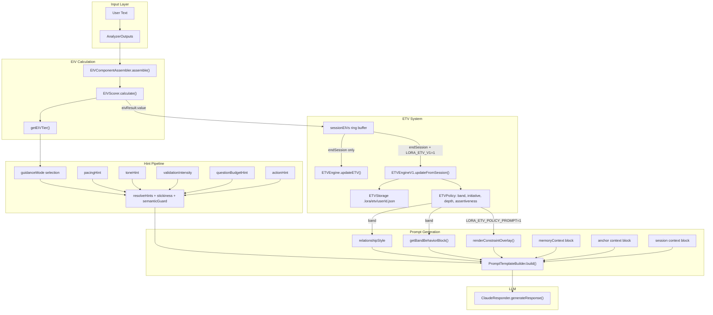

# 3-Tier Relational Trajectory Model: Audit and Refactor Plan

---

## A) Current State Audit

### A.1 — Pipeline Map



### A.2 — ETV Influence Points

ETV currently influences the system at exactly **3 injection points**:

- **`relationshipStyle`** — Legacy path: `etvState.value` mapped via thresholds (0.4, 0.6) to Professional / Friendly / Casual. Policy path: band mapped to PROFESSIONAL (B0-B1) or FRIENDLY (B2-B4). Appears in RELATIONAL CONTEXT section of prompt.
- **`getBandBehaviorBlock()`** — Band label (B0-B4) produces calibration text in BAND CALIBRATION section ("Early Stage", "Emerging Trust", "Stable", "Strong Trust", "Deep Trust").
- **`renderConstraintOverlay()`** — When `LORA_ETV_POLICY_PROMPT=1`: injects `[ETV_POLICY_CONSTRAINTS]` block with initiative (LOW/MODERATE/STANDARD), depth (SHALLOW/MODERATE/FULL), assertiveness, clarification bias.

**Critical finding: ETV does NOT influence:**

- `guidanceMode` (driven by EIV tier + arousal + volatility)
- `validationIntensity` (driven by appraisal bridge)
- `toneHint` (driven by appraisal bridge)
- `questionBudgetHint` (driven by appraisal bridge)
- `actionHint` (driven by appraisal bridge)
- `pacingHint` (driven by appraisal bridge)

This means the proposed tier model must inject at the hint level, not just at the ETV policy level.

### A.3 — Feature Flag Map

| Flag | Env Var | Default | Gates |

|------|---------|---------|-------|

| `etvV1Enabled` | `LORA_ETV_V1` | OFF | Beta ETV, AVI, band computation, file persistence |

| `etvPolicyPromptEnabled` | `LORA_ETV_POLICY_PROMPT` | OFF | Policy constraint overlay in prompt |

| `etvPolicyPromptShadowEnabled` | `LORA_ETV_POLICY_PROMPT_SHADOW` | OFF | Log-only policy diff |

| `memoryV1Enabled` | `LORA_MEMORY_V1` | OFF | Memory V1 episodic + schema |

| `memoryV1ShadowEnabled` | `LORA_MEMORY_V1_SHADOW` | OFF | Shadow-mode memory |

| `memoryServiceEnabled` | `LORA_MEMORY_SERVICE` | OFF | Dual DB (Falkor + Chroma) |

| `factAnchorEnabled` | `LORA_FACT_ANCHOR` | OFF | Fact anchor extraction + lifecycle |

| `bootstrapMemoryEnabled` | `LORA_BOOTSTRAP_MEMORY` | OFF | Cold-start bootstrap memory |

| `personaEnforcerEnabled` | `LORA_PERSONA_ENFORCER` | OFF (dev: ON) | Identity + relational override |

| `relationalRouterEnabled` | `LORA_RELATIONAL_ROUTER` | OFF | Relational intent short-circuit |

| `narrativeStateEngineEnabled` | `LORA_NSE` | OFF (dev: ON) | Narrative state engine |

| `responseShapeContractEnabled` | `LORA_RSC` | OFF (dev: ON) | Response shape contract |

| `appraisalBridgeEnabled` | `LORA_APPRAISAL_BRIDGE` | OFF | Full appraisal pipeline |

| `appraisalBridgeModeEnabled` | `LORA_APPRAISAL_BRIDGE_MODE` | OFF | Appraisal-driven hint overrides |

**Implicit ETV disablement:** When `LORA_ETV_V1=0` (default), the system uses only legacy ETV (in-memory scalar, no persistence, no bands, no policy). When `LORA_ETV_POLICY_PROMPT=0` (default), even if bands are computed, they never reach the prompt as constraint overlays.

### A.4 — Memory Architecture Summary

- **Memory V1 (episodic + schema):** Episodic events are in-memory only (max 30), not persisted. Schemas (centroid vectors + metadata) persist to Chroma. No raw transcript is ever stored.
- **Memory Service (Falkor + Chroma):** Fact anchors (template + slot, no raw text) in Falkor. Schema records in Chroma. Retrieved and injected per-message.
- **Bootstrap Memory:** Ephemeral summaries (120 chars each, max 150), graduation after 5 sessions. Themes extracted at graduation. Storage purged.
- **Session Transcript (STM):** In-memory only, per session. Last 8 turns sent to LLM via `sessionHistory`. Cleared on `endSession`.
- **ETV V1 State:** Persisted to `.lora/etv/{userId}.json` (r, s pseudo-counts). Survives restarts.

### A.5 — Risks in Current Structure

- **ETV has no behavioral teeth.** It sets relationship style and band text but doesn't control hint parameters (tone, pacing, question budget, validation). The LLM receives "Band B2 — Stable" but also gets appraisal-driven hints that can override any restraint.
- **Session counter is not persisted.** `sessionCounter` resets when the engine instance is recreated. There is no way to know "this is session 3 across all time."
- **ETV V1 is OFF by default.** Most users see only the legacy scalar path, which has no bands and no policy.
- **No tier concept exists.** There is no mapping from ETV trajectory to behavioral tier that constrains hints.
- **Bootstrap graduation threshold (5 sessions) is too slow** for the "feel difference by Session 2" requirement.

---

## B) Refactor Plan

### B.1 — New Module: `src/emotion-core/tier/RelationalTier.ts`

Define 3 tiers as a pure module:

```typescript
export type RelationalTier = 'TIER_1' | 'TIER_2' | 'TIER_3';

export interface TierPolicy {
  tier: RelationalTier;
  maxGuidanceModes: Set<string>;
  maxQuestionBudget: 'ZERO' | 'ONE' | 'TWO';
  validationIntensityCap: 'LOW' | 'MEDIUM' | 'HIGH';
  toneDefault: 'GENTLE' | undefined;
  actionHintAllowed: boolean;
  logicEmphasis: number;   // 0.0–1.0
  empathyEmphasis: number; // 0.0–1.0
  assertivenessCap: number;
  depthCap: 'SHALLOW' | 'MODERATE' | 'FULL';
  responseLength: 'SHORT' | 'MEDIUM' | 'LONG';
}
```

Tier policies (deterministic, no math):

- **TIER_1:** `maxGuidanceModes = {CALM_NEUTRAL, SUPPORTIVE_REFLECTION}`, `maxQuestionBudget = ONE`, `validationIntensityCap = LOW`, `toneDefault = GENTLE`, `actionHintAllowed = false`, `logicEmphasis = 0.2, empathyEmphasis = 0.8`, `assertivenessCap = 0.20`, `depthCap = SHALLOW`, `responseLength = SHORT`
- **TIER_2:** `maxGuidanceModes = {CALM_NEUTRAL, SUPPORTIVE_REFLECTION, STABILIZING, ENERGY_MATCH}`, `maxQuestionBudget = TWO`, `validationIntensityCap = MEDIUM`, `toneDefault = undefined`, `actionHintAllowed = true`, `logicEmphasis = 0.5, empathyEmphasis = 0.5`, `assertivenessCap = 0.45`, `depthCap = MODERATE`, `responseLength = MEDIUM`
- **TIER_3:** `maxGuidanceModes = {all}`, `maxQuestionBudget = TWO`, `validationIntensityCap = HIGH`, `toneDefault = undefined`, `actionHintAllowed = true`, `logicEmphasis = 0.7, empathyEmphasis = 0.3`, `assertivenessCap = 0.70`, `depthCap = FULL`, `responseLength = LONG`

### B.2 — Tier State Persistence: `src/emotion-core/tier/TierState.ts`

Extend the existing `ETVStorage` pattern:

```typescript
export interface TierStateStored {
  userId: string;
  currentTier: RelationalTier;
  sessionCount: number;
  etvTrajectory: number[];  // last 5 session etvMeans
  volatilityHistory: number[]; // last 5 session volatilities
  escalationCount: number;  // total escalation events
  lastTransitionAt: number; // epoch ms
  onboardingComplete: boolean;
  onboardingPreferences?: OnboardingData;
}
```

Persist to `.lora/tier/{userId}.json`. Load in `EngineOrchestrator` constructor alongside ETV.

### B.3 — Tier Transition Logic: `src/emotion-core/tier/tierTransition.ts`

Pure function, deterministic:

```typescript
export function computeTierTransition(state: TierStateStored, sessionSummary: SessionSummaryV1): RelationalTier
```

Rules:

- **TIER_1 -> TIER_2:** `sessionCount >= 2` AND `etvMean >= 0.35` AND `volatilityState !== 'HIGH'` AND `escalationCount < 3`
- **TIER_2 -> TIER_3:** `sessionCount >= 4` AND `etvMean >= 0.50` AND last 2 sessions have `volatilityState !== 'HIGH'` AND `escalationCount < 5`
- **Demotion TIER_3 -> TIER_2:** `etvMean < 0.35` OR `escalationCount >= 8`
- **Demotion TIER_2 -> TIER_1:** `etvMean < 0.25` OR 2 consecutive HIGH volatility sessions
- **No tier skipping:** Max one tier change per `endSession` call.

This guarantees visible change by end of Session 2 (TIER_1 -> TIER_2 unlocks).

### B.4 — Integration Point: `EngineOrchestrator.ts`

Insert tier logic at two points:

**In constructor (line ~228):**

```typescript
this.tierState = TierStorage.load(this.userId) ?? TierStorage.initState(this.userId);
```

**In `processMessage` (after hint resolution, before prompt build, ~line 960):**

```typescript
const tierPolicy = getTierPolicy(this.tierState.currentTier);
// Clamp hints to tier policy
guidanceMode = tierPolicy.maxGuidanceModes.has(guidanceMode) ? guidanceMode : 'CALM_NEUTRAL';
if (tierPolicy.maxQuestionBudget === 'ONE' && questionBudgetHint === 'TWO') questionBudgetHint = 'ONE';
if (!tierPolicy.actionHintAllowed) actionHint = undefined;
// ... similar for validationIntensity, toneHint
```

**In `endSession` (after ETV update, ~line 1210):**

```typescript
if (featureFlags.tierModelEnabled) {
  this.tierState.sessionCount += 1;
  this.tierState.etvTrajectory.push(fullState?.etvMean ?? sessionMean);
  this.tierState.currentTier = computeTierTransition(this.tierState, summary);
  TierStorage.save(this.tierState);
}
```

### B.5 — New Feature Flag

Add to [featureFlags.ts](src/emotion-core/config/featureFlags.ts):

```typescript
tierModelEnabled: flag(process.env.LORA_TIER_MODEL, 'tierModelEnabled'),
```

All tier logic gated behind this flag. Existing behavior untouched when OFF.

### B.6 — Files to Modify

- `src/emotion-core/config/featureFlags.ts` — add `tierModelEnabled`
- `src/emotion-core/engines/EngineOrchestrator.ts` — load tier state, clamp hints, update tier at session end
- `src/emotion-core/prompt/PromptTemplateBuilder.ts` — add tier overlay block
- `src/emotion-core/prompt/etvPolicyPromptMap.ts` — extend overlay to include tier-specific directives

### B.6 — New Files

- `src/emotion-core/tier/RelationalTier.ts` — types + policy table
- `src/emotion-core/tier/tierTransition.ts` — transition function
- `src/emotion-core/tier/TierState.ts` — storage (load/save/init)
- `src/emotion-core/tier/__tests__/tierTransition.test.ts`
- `src/emotion-core/tier/__tests__/RelationalTier.test.ts`

---

## C) Memory Adjustment Plan

### C.1 — Current Transcript Retention

- **STM (session turns):** In-memory only, cleared per session. No cross-session persistence.
- **Episodic buffer:** In-memory only, max 30 events, not persisted after consolidation.
- **Schemas:** Persisted in Chroma. Max 20. These are already pattern abstractions (centroid + metadata), not raw text.
- **Fact anchors:** Persisted in Falkor. Already template + slot, no raw text.
- **Bootstrap:** Summaries only (120 chars). Graduation at 5 sessions purges storage.

**Key insight:** LoRa already does NOT store raw transcripts across sessions. Schemas and anchors are already abstractions. The "5 sessions to 2" requirement primarily affects:

1. Bootstrap graduation threshold (5 -> 2)
2. Adding an explicit pattern aggregation step at Session 2 end

### C.2 — Changes Required

**In [src/emotion-core/config/featureFlags.ts](src/emotion-core/config/featureFlags.ts):**

- Change `bootstrapMemorySessionThreshold` default from 5 to 2 when `tierModelEnabled` is ON.

**In `EngineOrchestrator.endSession()` (~line 1240):**

- When `tierState.sessionCount === 2` and `tierModelEnabled`:
  - Trigger bootstrap graduation immediately
  - Run `maintainAnchors` to consolidate fact anchors
  - Persist a `TierSnapshot` containing: volatility signature, escalation frequency, ETV trajectory, emotional pattern aggregates
  - This snapshot feeds into `PromptTemplateBuilder` for Sessions 3+ when raw bootstrap data is gone

**New type in `src/emotion-core/tier/TierState.ts`:**

```typescript
export interface TierSnapshot {
  volatilitySignature: 'LOW' | 'MEDIUM' | 'HIGH';
  escalationFrequency: number;
  etvTrajectory: number[];
  dominantEmotionalPattern: string;
  preferredTone?: string; // from onboarding
}
```

### C.3 — PromptTemplateBuilder After Purge

Add a new block method `getTierContextBlock(tierState, tierSnapshot)` that renders:

```
RELATIONAL TRAJECTORY
---------------------
Tier: [TIER_1|TIER_2|TIER_3]
Sessions: N
Volatility pattern: [LOW|MEDIUM|HIGH]
Emotional tendency: [from snapshot]
Preferred tone: [from onboarding, if available]
```

This replaces bootstrap context after Session 2 and provides the LLM with stable behavioral grounding without raw transcript.

### C.4 — Avoiding Memory V1 Test Regression

- All memory V1 tests use `memoryV1Enabled` flag, which is independent.
- Tier model is behind its own flag (`tierModelEnabled`).
- Bootstrap threshold change is conditional on `tierModelEnabled`.
- No existing memory V1 types or interfaces are modified.
- New tests cover tier-specific behavior independently.

---

## D) PromptTemplateBuilder Changes

### D.1 — Tier Overlay Block

New method in [PromptTemplateBuilder.ts](src/emotion-core/prompt/PromptTemplateBuilder.ts):

```typescript
private static getTierOverlayBlock(tier: RelationalTier, tierPolicy: TierPolicy): string {
  const lines: string[] = [];
  lines.push('\n[RELATIONAL_TIER_POLICY]');

  switch (tier) {
    case 'TIER_1':
      lines.push('- Approach: Conservative. Prioritize empathy over logic.');
      lines.push('- Keep responses concise. Do not offer unsolicited suggestions.');
      lines.push('- Ask at most one question per response.');
      lines.push('- Do not restructure the user\'s framing or challenge their perspective.');
      break;
    case 'TIER_2':
      lines.push('- Approach: Balanced. Equal weight to empathy and structured reasoning.');
      lines.push('- Suggestions are allowed when contextually appropriate.');
      lines.push('- May ask up to two questions if relevant.');
      lines.push('- Light cognitive reframing is acceptable.');
      break;
    case 'TIER_3':
      lines.push('- Approach: Direct. Lead with clarity and structure.');
      lines.push('- Cognitive reframing and pattern observation are encouraged.');
      lines.push('- Minimize reassurance loops. Be concise and purposeful.');
      lines.push('- Action-oriented suggestions are preferred.');
      break;
  }

  return lines.join('\n');
}
```

### D.2 — How Tier Modifies Existing Signals

All modifications happen in `EngineOrchestrator.processMessage()` after hint resolution, before prompt build. The tier clamps hints — it never generates them from scratch.

- **validationIntensity:** Clamped to `tierPolicy.validationIntensityCap`. TIER_1 forces LOW.
- **toneHint:** TIER_1 defaults to GENTLE if no appraisal override. TIER_2/3 leave tone to appraisal.
- **questionBudgetHint:** TIER_1 caps at ONE. TIER_2/3 allow TWO.
- **actionHint:** TIER_1 suppresses action hints entirely. TIER_2/3 allow them.
- **guidanceMode:** TIER_1 restricts to `{CALM_NEUTRAL, SUPPORTIVE_REFLECTION}`. Anything outside is clamped to CALM_NEUTRAL.

### D.3 — No Raw Numeric Values

The tier overlay block uses categorical labels only (Conservative / Balanced / Direct). The `logicEmphasis` and `empathyEmphasis` values are used internally for hint clamping but never rendered into prompt text.

---

## E) Compatibility Verification

### E.1 — Does This Break Existing Systems?

- **EIV:** No. EIV calculation is untouched. Tier reads EIV results but doesn't modify the scorer.
- **Appraisal Bridge:** No. Appraisal still generates hints normally. Tier only clamps outputs after resolution.
- **DecisionLogger:** Extend `MessageDecisionLog` with optional `tier` field. Non-breaking addition.
- **Memory V1 Invariants:** No. Memory V1 types, schemas, episodic buffer are untouched. Tier state is a separate storage path.
- **Persona Enforcer:** No. PersonaEnforcer runs before tier clamping. Identity/relational overrides still short-circuit.

### E.2 — Architecture Changes Required

- New feature flag: `LORA_TIER_MODEL`
- New storage path: `.lora/tier/{userId}.json`
- `EngineOrchestrator` constructor: load tier state (2 lines)
- `EngineOrchestrator.processMessage`: tier clamping block (~20 lines, after hint resolution)
- `EngineOrchestrator.endSession`: tier transition + persist (~15 lines)
- `PromptTemplateBuilder.build`: add tier overlay to prompt (~5 lines)
- `PromptTemplateBuilder`: new helper method (~30 lines)

### E.3 — Tests That Require Modification

- **`chat.route.stm.test.ts`** — No change (tier is OFF by default)
- **`chat.route.relational.test.ts`** — No change (tier is OFF by default)
- **`chat.route.smoke.test.ts`** — No change
- **`freeze.invariants.test.ts`** — May need update if it asserts exact prompt content (unlikely since tier is gated)
- **`PromptTemplateBuilder.*.test.ts`** — Add new test file for tier overlay; existing tests unaffected (tier OFF)
- **`EngineOrchestrator.*.test.ts`** — Existing tests unaffected. New test file for tier clamping behavior.
- **`ValidationIntensity.invariant.test.ts`** — May need a variant with tier ON to test clamping.

Estimate: **0 existing tests break** when `LORA_TIER_MODEL` is OFF (default). ~8-12 new test files needed.

---

## F) Fast Impact Guarantee

### F.1 — User Perceives Change Within 2 Sessions

The transition rule `TIER_1 -> TIER_2` at `sessionCount >= 2` with `etvMean >= 0.35` (achievable in any normal conversation without violations) guarantees:

- **Session 1:** TIER_1 — conservative, empathetic, short answers, max 1 question, no suggestions, GENTLE tone default.
- **Session 2:** Still TIER_1 but ETV is accumulating. At `endSession`, if conditions met, tier upgrades.
- **Session 3:** TIER_2 — balanced, suggestions allowed, moderate depth, up to 2 questions, cognitive reframing starts.

The difference between TIER_1 and TIER_2 is stark:

- Question budget doubles (ONE -> TWO)
- Suggestions unlock
- Guidance modes expand (STABILIZING, ENERGY_MATCH added)
- Tone shifts from GENTLE-by-default to appraisal-driven
- Depth moves from SHALLOW to MODERATE

### F.2 — Without Degrading Safety

- Tier never overrides safety violations. `hasViolation` demotes ETV, which feeds into tier transition checks.
- Escalation count is tracked. Escalation abuse prevents tier progression.
- Tier demotion is automatic if ETV drops or volatility spikes.
- CONTAINMENT and DE_ESCALATE guidance modes are always available regardless of tier (safety override).

### F.3 — Onboarding Accelerator

If onboarding quiz is completed before Session 1:

- `toneDefault` is pre-set from quiz preference (direct -> skip GENTLE default even in TIER_1)
- ETV baseline can be adjusted: `initR` boosted by 0.5 for users who select "logical" regulation style
- This doesn't skip TIER_1 but makes the TIER_1 experience feel calibrated rather than generic

---

## G) Onboarding Quiz Design

### G.1 — Quiz Module: `src/emotion-core/onboarding/onboardingQuiz.ts`

```typescript
export interface OnboardingData {
  name?: string;
  preferredTone: 'direct' | 'gentle' | 'logical';
  emotionalRegulation: 'analytical' | 'expressive' | 'balanced';
  goalOrientation: 'clarity' | 'support' | 'growth';
}

export function computeOnboardingBaseline(data: OnboardingData): {
  etvBoost: number;        // 0.0–0.5 added to initR
  tonePreference: string;  // fed into TIER_1 toneDefault
  logicBias: number;       // 0.0–0.3 added to logicEmphasis
} {
  // deterministic mapping, no ML
}
```

### G.2 — Integration

- Route: New `POST /api/onboarding` endpoint in [chat.route.ts](src/server/routes/chat.route.ts)
- Storage: Saved as part of `TierStateStored.onboardingPreferences`
- Consumed by: `getTierPolicy()` to adjust TIER_1 defaults based on preferences
- Prevents hallucination: Quiz data is structured (enum values), not free text. Survives transcript purge as part of tier state.

---

## H) Minimal Code Diff Strategy

### Injection points (not rewrites):

- **EngineOrchestrator:** ~40 lines added (constructor load, processMessage clamp, endSession transition). No existing lines modified.
- **PromptTemplateBuilder:** ~35 lines added (new method + 3-line call in `build()`). No existing methods modified.
- **featureFlags.ts:** 1 line added.
- **New files:** 5 source files + 3 test files (~400 lines total new code).
- **Existing files modified:** 3 (EngineOrchestrator, PromptTemplateBuilder, featureFlags).

Total diff: ~500 lines added, ~0 lines removed, ~0 lines modified.

---

## Summary Scores

- **Feasibility:** 9/10 — The architecture already has the hooks (bands, hint pipeline, feature flags, storage patterns). Tier is a clean overlay.
- **Refactor Complexity:** **Low-Medium** — No architectural redesign. Pure additive. Gated by feature flag. Existing tests unaffected.
- **Integration Assessment:** The tier model integrates **cleanly** with the current architecture. It layers on top of the existing hint pipeline as a post-resolution clamp, uses the existing storage pattern, and extends the existing prompt template with a new block. No major redesign required.