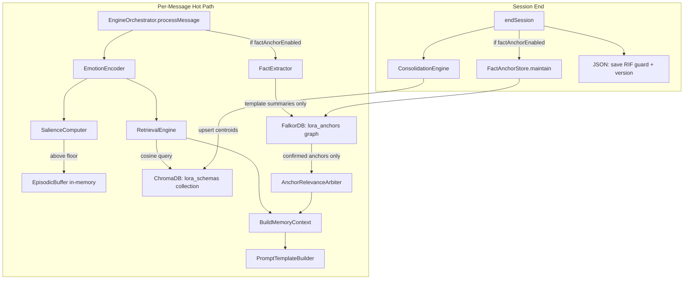

# Dual Database Pipeline -- Hardened Implementation Plan

All 10 original critique items + 8 new critique items (6 critical, 2 medium) are addressed inline. Each fix is marked with the risk/critique ID it resolves.

**New fixes in this revision:**

- Critique #1: FalkorDB purge uses `DETACH DELETE` on all userId-scoped nodes (not just User adjacency)
- Critique #2: Both-DBs-down still runs memory via JSON schemas; only anchors disabled
- Critique #3: Rounding only at serialization boundaries, never during in-memory math
- Critique #4: `AnchorSummaryTemplate` uses enum-based templates + finite allowlisted slots (no freeform strings)
- Critique #5: Name storage requires literal remember-intent trigger patterns only
- Critique #6: Anchor eligibility governed by ETV bands (B0/B1: none, B2: 1 upcoming, B3: 2, B4: 3)
- Critique #7 (medium): `MAX_ANCHORS_CONFIRMED = 15` and `MAX_ANCHORS_QUARANTINED = 10` are per-user-global
- Critique #8 (medium): `deterministicSort` moved to new `determinism.ts`, keep `normalize.ts` math-only

**Refinement fixes (R1-R7):**

- R1: Anchor slot rigidity acknowledged as intentional precision-over-recall for V1; documented as known trade-off
- R2: `appearsInSessions` tracked via `lastSeenSessionId`; only incremented on session boundary crossing
- R3: emotionalProximity 0.40 weight flagged for live monitoring (no change, gated by reinforceCount >= 2)
- R4: Unified purge operations are idempotent; "nothing to delete" treated as success, not error
- R5: Degraded mode flags are session-scoped, reset on session start, logged exactly once per session
- R6: Prompt rendering order is fixed and deterministic: GLOBAL CONSTRAINTS > MEMORY CONTEXT (schemas) > FACT CONTEXT (anchors)
- R7: `MAX_ANCHORS_IN_PROMPT = 3` absolute hard ceiling, enforced independently of band logic

---

## Architecture: Split Storage Model

**FIX for Risk #2:** Storage responsibilities are split, not jammed into one interface.

- **Vector Store (ChromaDB):** Schema centroids + metadata only. One collection `lora_schemas`, partitioned by `userId` metadata. **(FIX Risk #1)**
- **State Store (JSON):** RIF guard state, version tags, non-vector state. Stays as `createJSONStorage()` -- unchanged.
- **Graph Store (FalkorDB):** Fact anchors as a single graph `lora_anchors`, scoped by `userId` node property on every query. **(FIX Risk #1)**
- **Episodes:** Session-only, in-memory. No database. Cleared on session end after consolidation. **(Correction B)**



---

## Degraded Mode Semantics (FIX Risk #5, FIX Critique #2)

Never block response generation because a DB call failed. Never disable the entire memory engine unless JSON is corrupt.

- **ChromaDB down:** Fall back to JSON-loaded schemas (already cached in `memoryV1State`). Log `[LoRa::MemoryChromaFail]`. Emotional memory continues with last-known-good schemas from JSON.
- **FalkorDB down:** Skip anchors silently. Log `[LoRa::MemoryFalkorFail]`. Emotional memory works normally, factual anchors absent.
- **Both down:** Emotional memory STILL RUNS with JSON schemas. Only anchors disabled. Log `[LoRa::MemoryDualFail]`. The memory engine is NOT turned off -- schemas from JSON continue to provide emotional continuity.
- **Memory engine disabled only if:** JSON state is corrupt AND ChromaDB is unreachable (no schemas from any source).
- **Implementation:** Every DB call wrapped in try/catch. Failure sets per-session `chromaDegraded` / `falkorDegraded` flags (separate, not a single flag). No retries in hot path.
- **Flag scoping rules (R5):**
  - Flags are initialized to `false` at session start (`processMessage` first call).
  - Once set to `true`, they remain `true` for the rest of that session only.
  - They do NOT persist across sessions -- next session starts clean.
  - Each flag is logged exactly once per session on first failure (not on every failed DB call).
  - No silent permanent anchor disabling -- every new session re-attempts DB connections.

---

## Unified Purge (FIX Risk #6)

One entrypoint: `deleteUserMemory(userId)`.

```typescript
async function deleteUserMemory(userId: string): Promise<PurgeResult> {
  const results: PurgeResult = { chromaOk: false, falkorOk: false, jsonOk: false, errors: [] };

  // Chroma: delete all vectors with this userId in metadata
  try {
    await chromaCollection.delete({ where: { userId } });
    results.chromaOk = true;
  } catch (err) { results.errors.push({ store: 'chroma', error: String(err) }); }

  // Falkor: DETACH DELETE all nodes scoped by userId property (FIX Critique #1)
  // Every node in the graph carries a userId property -- not just User nodes.
  // DETACH DELETE removes all edges connected to matched nodes automatically.
  try {
    await falkorGraph.query(`MATCH (n {userId: $userId}) DETACH DELETE n`, { userId });
    results.falkorOk = true;
  } catch (err) { results.errors.push({ store: 'falkor', error: String(err) }); }

  // JSON: remove .lora/memory-v1/{userId}/ directory
  try {
    jsonStorage.delete(userId);
    results.jsonOk = true;
  } catch (err) { results.errors.push({ store: 'json', error: String(err) }); }

  return results;
}
```

All three stores wiped. Best-effort: if one store fails, continue with remaining stores, log all failures with audit trail. `PurgeResult` returned so caller can verify completeness.

**Idempotency guarantees (R4):**

- Running purge twice does not throw. Deleting non-existent data is treated as success (not error).
- Partial purge followed by retry does not corrupt state.
- `errors[]` only populated for real I/O failures, not "nothing to delete" cases.
- Each `delete()` operation internally catches "not found" and returns `true`.

---

## Component Breakdown

### Step 1: Shared cosine utility + deterministic helpers

**File:** `src/emotion-core/memory-v1/normalize.ts` (edit existing) -- cosine only

- Extract `cosineSimilarity(a, b)` from 4 duplicated implementations into `normalize.ts`
- All 4 files (`retrievalEngine`, `consolidationEngine`, `memoryV1Engine`, `runtime`) import from here

**File:** `src/emotion-core/memory-v1/determinism.ts` (new) -- sorting + serialization **(FIX Critique #8)**

- `deterministicSort(items, key)` helper for post-DB-query sorting **(FIX Risk #7)**
- `roundForSerialization(vec, decimals)` -- round only at save/load boundaries, never during in-memory math **(FIX Critique #3)**
- Keep `normalize.ts` clean as math-only utilities

### Step 2: Fact Anchor types

**File:** `src/emotion-core/memory-v1/factAnchorTypes.ts` (new)

- `FactAnchor` type with: anchorId, userId, type (ALLOWLISTED: `date_event | person | preference | goal`), summary (template-based via `AnchorSummaryTemplate`), date?, entityRole, salience, extractionConfidence, status, emotionVecAtCreation, sessionId, createdAt, expiresAt?, reinforceCount, appearsInSessions, lastSeenSessionId
- **`appearsInSessions` tracking rule (R2):** Track `lastSeenSessionId` on each anchor. On reinforce: if `currentSessionId !== lastSeenSessionId`, increment `appearsInSessions` and update `lastSeenSessionId`. If same session, only increment `reinforceCount`. This prevents single-session spam from gaming promotion logic.
- `ALLOWED_ANCHOR_TYPES` allowlist for V1 **(FIX Risk #3)**
- `AnchorSummaryTemplate` type: **enum-based templates with finite allowlisted slots** **(FIX Critique #4)**

```typescript
type AnchorTemplate =
  | 'upcoming_event' | 'past_event' | 'recurring_event'
  | 'person_role' | 'preference_positive' | 'preference_negative'
  | 'goal_active' | 'goal_completed';

type AnchorSlot =
  | 'job_interview' | 'exam' | 'meeting' | 'birthday' | 'appointment'
  | 'wedding' | 'travel' | 'deadline' | 'therapy_session' | 'graduation'
  | 'friend' | 'therapist' | 'family_member' | 'manager' | 'partner'
  | 'colleague' | 'doctor' | 'mentor'
  | 'exercise' | 'diet' | 'career_change' | 'learning' | 'hobby'
  | 'general_positive' | 'general_negative';

type AnchorSummaryTemplate = { template: AnchorTemplate; slot: AnchorSlot };
```

If the extracted content does not map to an allowlisted slot, the anchor is **not created**. No freeform strings. **(FIX Critique #4)**

**Known V1 trade-off (R1):** This is a closed ontology. Events like "court hearing", "visa appointment", "startup pitch" will not produce anchors. V1 anchors are intentionally precision-over-recall: extremely conservative, sparse, and biased toward predefined life categories. This is acceptable for V1 -- the slot list is expanded in V2 based on real usage data, not speculation.

- Entity storage: `entityRole` from finite enum (`friend | therapist | family_member | manager | partner | colleague | doctor | mentor`). Exact name stored ONLY when user provides explicit remember-intent trigger **(FIX Critique #5)**:
  - Literal patterns: "remember that X is my...", "save that...", "don't forget..."
  - Everything else -> role only, no name
- Global capacity constants **(FIX Critique #7, R7)**:
  - `MAX_ANCHORS_CONFIRMED = 15` (per-user-global)
  - `MAX_ANCHORS_QUARANTINED = 10` (per-user-global)
  - `MAX_ANCHORS_IN_PROMPT = 3` (absolute hard ceiling, enforced at render time independently of band logic)

### Step 3: FactExtractor (pure regex, no DB)

**File:** `src/emotion-core/memory-v1/factExtractor.ts` (new)

- Precision-first: very conservative patterns only **(FIX Risk #9)**
- Max 1 anchor per message, max 3 per session
- Require explicit markers: "my goal is...", "I like/love/hate...", "on [date]...", "interview/exam/meeting..."
- No proper-noun-only extraction -- require co-occurring relationship signal
- Confidence scoring with base scores per pattern type
- Output uses `AnchorSummaryTemplate` -- never raw text spans **(FIX Risk #3)**
- Stoplist for common capitalized non-entities

### Step 4: Quarantine logic (hardened) (FIX Risk #4)

Built into `factAnchorTypes.ts` constants + `factAnchorStore.ts` logic:

- Quarantine threshold: confidence < 0.60
- **Promotion requires TWO independent signals:**
  - `reinforceCount >= 2`, OR
  - `reinforceCount >= 1 AND extractionConfidence >= 0.80 AND appearsInSessions >= 2`
- Quarantine expiry: 3 sessions unreinforced -> delete
- **Max quarantined cap: 10 per user.** Beyond that, oldest quarantined evicted first.

### Step 5: AnchorRelevanceArbiter (pure math, no DB)

**File:** `src/emotion-core/memory-v1/anchorRelevanceArbiter.ts` (new)

- Scoring: emotionalProximity (0.40) + recency (0.30) + reinforcement (0.20) + temporalUrgency (0.10)
- **Hard eligibility gate before scoring (FIX Risk #8):**
  - Upcoming events within 7 days: always eligible (override)
  - All other anchors: eligible ONLY if `reinforceCount >= 2`
  - This prevents single-mention anchors from ever reaching the prompt
- Floor: arbiterScore < 0.25 -> suppressed
- **ETV band gating on anchor count (FIX Critique #6):**
  - B0/B1: no anchors (zero)
  - B2: max 1 anchor, only upcoming events
  - B3: max 2 anchors, upcoming + reinforceCount >= 2
  - B4: max 3 anchors (full access)
- **Absolute hard ceiling: `MAX_ANCHORS_IN_PROMPT = 3`** -- enforced independently of band logic, prevents future band changes from expanding injection unintentionally **(R7)**
- Only confirmed anchors eligible. Arbiter receives the ETV band as input and enforces the cap before returning results.
- **Monitoring note (R3):** emotionalProximity at 0.40 can pull emotionally-similar but semantically-unrelated anchors. Mitigated by `reinforceCount >= 2` gate, but log anchor-emotion cosine distances in decision logs for live testing review.

### Step 6: Tests for pure logic (Steps 2-5)

- `factExtractor.test.ts` -- extraction accuracy, template enforcement, per-session cap, stoplist
- `factAnchorStore.test.ts` (against InMemoryFactAnchorStore) -- upsert, quarantine, hardened promotion, expiry, cap, purge
- `anchorRelevanceArbiter.test.ts` -- scoring, eligibility gate, floor, override, empty input

### Step 7: Feature flags

**File:** `src/emotion-core/config/featureFlags.ts` (edit)

- Add `factAnchorEnabled: boolean` (independent of `memoryV1Enabled`)
- Add `memoryV1ChromaEnabled: boolean` (gates ChromaDB vs JSON for schemas)

### Step 8: FactAnchorStore interface + InMemory implementation

**File:** `src/emotion-core/memory-v1/factAnchorStore.ts` (new)

- Define `FactAnchorStoreInterface`: `upsert`, `getCandidates`, `maintain`, `purgeAll`, `exportAll`
- `InMemoryFactAnchorStore` implements the interface with plain arrays **(Correction A)**
- All tests run against InMemory first
- FalkorDB adapter comes later as a separate file

### Step 9: ChromaDB install + client

- `npm install chromadb`
- **File:** `src/emotion-core/memory-v1/db/chromaClient.ts` (new)
- Singleton client, connection via env vars (`LORA_CHROMA_URL`)
- Single collection: `lora_schemas` with `userId` in metadata **(FIX Risk #1)**
- Deterministic sort on all query results by `schemaId` ASC **(FIX Risk #7)**

### Step 10: ChromaDB schema adapter

**File:** `src/emotion-core/memory-v1/db/ChromaSchemaAdapter.ts` (new)

- Schemas only (centroids + metadata). No episodes, no guard state. **(FIX Risk #2, Correction B)**
- `saveSchemas(userId, schemas[])` -> upsert embeddings with metadata `{ userId, schemaId, salienceWeight, episodeCount, ... }`
- `loadSchemas(userId)` -> query by `{ userId }`, reconstruct `SchemaRecord[]`, sort by schemaId
- Round centroid floats to 6 decimal places at serialization boundaries only (save/load), NEVER during in-memory math. Uses `roundForSerialization` from `determinism.ts` **(FIX Risk #7, FIX Critique #3)**
- Degraded mode: if ChromaDB unreachable, return null -> caller falls back to JSON **(FIX Risk #5)**

### Step 11: Storage factory

**File:** `src/emotion-core/memory-v1/db/storageFactory.ts` (new)

- If `memoryV1ChromaEnabled`: use ChromaSchemaAdapter for schemas, JSON for guard/version state
- If not: use existing `createJSONStorage()` for everything (current behavior, unchanged)
- EngineOrchestrator: replace `createJSONStorage(this.memoryV1BaseDir)` with factory call

### Step 12: FalkorDB install + adapter

- `npm install falkordblite`
- **File:** `src/emotion-core/memory-v1/db/falkorClient.ts` (new)
- **File:** `src/emotion-core/memory-v1/db/FalkorAnchorAdapter.ts` (new)
- Implements `FactAnchorStoreInterface`
- Single graph `lora_anchors`, every query scoped by `userId` property **(FIX Risk #1)**
- `purgeAll(userId)` uses `MATCH (n {userId: $userId}) DETACH DELETE n` -- deletes ALL nodes with userId property and their edges, not just User-adjacent nodes **(FIX Risk #6, FIX Critique #1)**
- Degraded mode: if FalkorDB unreachable, skip anchors, log drift flag **(FIX Risk #5)**

### Step 13: Unified purge entrypoint

**File:** `src/emotion-core/memory-v1/db/purgeUserMemory.ts` (new)

- `deleteUserMemory(userId)`: wipes JSON state + Chroma vectors by userId metadata + Falkor graph nodes by userId **(FIX Risk #6)**
- Best-effort: if one store fails, continue with others, log all failures
- All delete operations are idempotent: double-purge does not throw, "nothing to delete" = success **(R4)**

### Step 14: EngineOrchestrator wiring

**File:** `src/emotion-core/engines/EngineOrchestrator.ts` (edit)

- `processMessage()` (~line 715): add fact extraction + anchor retrieval + arbiter scoring, gated by `factAnchorEnabled`
- `endSession()` (~line 1046): add anchor maintenance, gated by `factAnchorEnabled`
- Replace `createJSONStorage()` with storage factory call
- All DB calls wrapped in try/catch with degraded mode fallback **(FIX Risk #5)**

### Step 15: PromptTemplateBuilder anchor rendering (FIX Risk #10)

**File:** `src/emotion-core/prompt/PromptTemplateBuilder.ts` (edit)

- Extend `memoryContext` to include `relevantAnchors`
- **Fixed prompt rendering order (R6):** Deterministic, tested, never varies:
  1. GLOBAL CONSTRAINTS (system prompt, persona, forbidden phrases)
  2. MEMORY CONTEXT (emotional schemas -- top schemas, session pattern, confidence)
  3. FACT CONTEXT (anchors -- rendered after schemas, never before)
  4. USER MESSAGE

  This order is enforced in the builder and tested in integration tests. Anchors never appear above schemas.
- Anchor rendering contract:
  - Prefix: "Possible context:" NOT "You said..." or "I remember..."
  - Append question tag: "Does this relate to what you mean today?"
  - No companionship/intimacy language (reuse existing FORBIDDEN_PHRASES)
  - Obey ETV band gating: B0-B1 -> no anchors, B2+ -> progressive
  - **Hard ceiling: never render more than `MAX_ANCHORS_IN_PROMPT` (3) regardless of band or arbiter output (R7)**
- If `factAnchorEnabled = false` -> zero anchor content

### Step 16: Decision logs for anchors

**File:** `src/emotion-core/memory-v1/decisionLogs.ts` (edit)

- `makeMemoryAnchorExtractLog()` -- type, template summary (no raw text), confidence, status
- `makeMemoryAnchorMaintainLog()` -- expired count, evicted count, promoted count

### Step 17: Integration + regression tests

- ChromaDB adapter tests (save/load round-trip, deterministic ordering, degraded mode)
- FalkorDB adapter tests (upsert, query scoping, purgeAll, degraded mode)
- Full pipeline integration test (message -> encode -> extract -> retrieve -> prompt)
- Unified purge test across all 3 stores
- **Existing 1,772 tests must pass with zero regressions**
- Real DB tests gated behind `LORA_TEST_DB=1` env variable **(FIX Risk #7)**

---

## Execution Order

1. Steps 1-6: Pure logic, no DB. All types, extractor, quarantine, arbiter, tests.
2. Steps 7-8: Feature flags + InMemoryFactAnchorStore. Full test coverage against in-memory.
3. Steps 9-11: ChromaDB client + adapter + storage factory.
4. Step 12: FalkorDB adapter.
5. Steps 13-16: Unified purge, orchestrator wiring, prompt rendering, decision logs.
6. Step 17: Integration + regression tests.

**Do not integrate FalkorDB before the pure anchor logic is battle-tested.**
