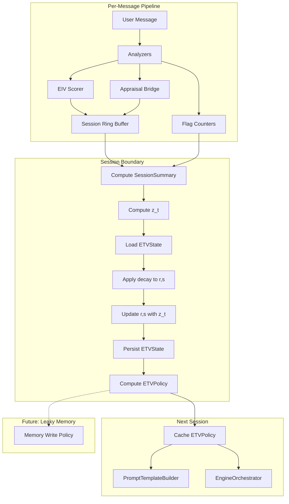

# ETV V1: Emotional Trust Value -- Formal Engineering Blueprint

**Version:** 1.0.0
**Date:** 2026-02-25
**Status:** SPECIFICATION (pre-implementation)
**Scope:** `src/emotion-core/etv/` module, integration with `EngineOrchestrator`, storage layer
**Authors:** LoRa Architecture Team

---

## Table of Contents

1. [Definition and Scope](#1-definition-and-scope)
2. [Goals](#2-goals)
3. [Non-Goals](#3-non-goals)
4. [System Boundaries](#4-system-boundaries)
5. [Data Flow](#5-data-flow)
6. [Interfaces and Types](#6-interfaces-and-types)
7. [Core Model: Discounted Beta (Beta-with-Decay)](#7-core-model-discounted-beta-beta-with-decay)
8. [Session Evidence Score z_t](#8-session-evidence-score-z_t)
9. [Update Procedure](#9-update-procedure)
10. [Temporal Decay Model](#10-temporal-decay-model)
11. [Professional Capability Bands](#11-professional-capability-bands)
12. [Gating Policy Map](#12-gating-policy-map)
13. [Stability-Plasticity and Per-User Adaptation](#13-stability-plasticity-and-per-user-adaptation)
14. [Initialization and Cold Start](#14-initialization-and-cold-start)
15. [Strict Invariants](#15-strict-invariants)
16. [Storage Schema](#16-storage-schema)
17. [Observability and Logging](#17-observability-and-logging)
18. [Implementation Architecture](#18-implementation-architecture)
19. [Testing Strategy](#19-testing-strategy)
20. [Failure Modes](#20-failure-modes)
21. [Rollout Plan](#21-rollout-plan)
22. [Four Pillars Summary](#22-four-pillars-summary)
23. [Future Compatibility](#23-future-compatibility)

---

## 1. Definition and Scope

ETV (Emotional Trust Value) is a **competence-based, uncertainty-aware calibration scalar** maintained per user. It updates **only at session boundaries** using session-level aggregates and gates the assistant's behavioral depth, initiative, and personalization strength.

ETV is **not** an attachment score. It is **not** a bonding metric. It is **not** a companionship tier.

ETV is a **risk regulator** and **personalization controller**.

### Formal definition

ETV is the posterior mean of a Beta distribution over a latent "interaction reliability" parameter, maintained via discounted pseudo-counts that accumulate session-level evidence and decay with elapsed time between sessions.

**Grounding:** The concept of calibrated trust as accuracy of trust relative to capability (not maximization of trust) is established by Holland et al. (2024): *"Calibrated trust is the extent to which the judgments of trust are accurate... trust appropriately reflects the automation's capabilities"* [Report 1, Claim 1a]. Merritt (2015) operationalizes this as *"correspondence between aid reliability and user trust in the aid"* [Report 1, Claim 1b]. Wischnewski et al. (CHI 2023) confirm that *"overtrust and undertrust both constitute miscalibrated trust"* [Report 1, Claim 1c].

---

## 2. Goals

| ID | Goal | Pillar |
|---|---|---|
| G1 | Prevent over-disclosure, over-initiative, and "babbling" for new or volatile users | Boundary Governance |
| G2 | Provide per-user behavioral parameterization at scale | Personalization Control |
| G3 | Retain behavioral momentum across sessions without cold-start reset | Cross-Session Continuity |
| G4 | Reduce initiative and assertiveness when calibration uncertainty is high | Uncertainty-Aware Risk Regulation |
| G5 | Produce clean, typed outputs consumable by future modules (Leaky Memory) | Interface Stability |

---

## 3. Non-Goals

| ID | Explicitly excluded |
|---|---|
| NG1 | Affective bonding, attachment tiers, companionship scoring |
| NG2 | Per-message ETV updates (ETV updates only at session boundaries) |
| NG3 | Raw transcript storage or access within the ETV module |
| NG4 | Leaky Memory implementation (future consumer only) |
| NG5 | User-facing trust scores or explanations |
| NG6 | Cross-user ETV comparison or ranking |
| NG7 | Emotional closeness or relationship depth measurement |

---

## 4. System Boundaries

```
+-----------------------------------------------------------------------+
|  Per-Message Pipeline (within session)                                |
|                                                                       |
|  Analyzers --> EIV Scorer --> Appraisal Bridge --> Hint Pipeline       |
|       |            |               |                                  |
|       v            v               v                                  |
|  [EIV_t]      [flags_t]     [AVI_t, pressure_t]                      |
|       \            |              /                                   |
|        +---- accumulate in session ring buffers ----+                 |
|                                                                       |
+-----------------------------------------------------------------------+
                            |
                    SESSION BOUNDARY
                    (inactivity > 35 min)
                            |
                            v
+-----------------------------------------------------------------------+
|  Session-End Aggregation                                              |
|                                                                       |
|  SessionSummary = f(ring buffers, flag counters, message count)       |
|       |                                                               |
|       v                                                               |
|  z_t = evidenceScore(SessionSummary)                                  |
|       |                                                               |
|       v                                                               |
|  ETVEngine.updateFromSession(userId, z_t, SessionSummary)             |
|       |                                                               |
|       +---> decay(r, s, delta_t)                                      |
|       +---> r += M * z_t;  s += M * (1 - z_t)                        |
|       +---> persist ETVState                                          |
|       +---> compute ETVPolicy                                         |
|                                                                       |
+-----------------------------------------------------------------------+
                            |
                            v
+-----------------------------------------------------------------------+
|  Next Session Start                                                   |
|                                                                       |
|  ETVPolicy = policyMap(load ETVState)                                 |
|  Orchestrator caches ETVPolicy for session duration                   |
|  PromptTemplateBuilder consumes ETVPolicy (not raw counts)            |
|                                                                       |
+-----------------------------------------------------------------------+
                            |
                            v (future)
+-----------------------------------------------------------------------+
|  Leaky Memory (NOT IMPLEMENTED)                                       |
|  Consumes: ETVPolicy.etvMean, ETVPolicy.etvVar, ETVPolicy.band       |
+-----------------------------------------------------------------------+
```

### Boundary rules

- The ETV module **reads only** `SessionSummary` objects. It never reads raw messages, transcripts, or per-message signal arrays.
- The ETV module **writes only** to `etv_state` and `etv_sessions` tables. It never writes to message logs.
- The ETV module **exports only** `ETVState` and `ETVPolicy` types. No internal Beta parameters leak to the prompt builder.
- The session boundary threshold (35 minutes of user inactivity) is an **engineering heuristic**, not a literature claim. It defines the operational unit of an "interaction episode."

---

## 5. Data Flow



---

## 6. Interfaces and Types

### 6.1 SessionSummary (input to ETV)

```typescript
type SessionSummary = {
  sessionId: string;
  userId: string;
  startedAt: number;       // epoch ms
  endedAt: number;         // epoch ms
  messageCount: number;

  // Master aggregates (bounded 0..1)
  eivMean: number;
  eivMax: number;
  aviMean: number;
  aviMax: number;

  // Session stability / quality features (bounded 0..1)
  correctionRate: number;
  clarificationRate: number;
  contradictionRate: number;
  safetyTriggerRate: number;

  // Confidence proxy from analyzer agreement (bounded 0..1)
  inferenceReliability: number;
};
```

All numeric fields are bounded in \[0, 1\]. `messageCount` is a positive integer. Timestamps are epoch milliseconds.

### 6.2 ETVState (persisted per user)

```typescript
type ETVState = {
  userId: string;

  // Discounted pseudo-counts (always > 0)
  r: number;
  s: number;

  // Derived (computed, not stored separately in DB)
  etvMean: number;         // r / (r + s)
  etvVar: number;          // Beta variance
  effectiveN: number;      // r + s

  // Time bookkeeping
  lastSessionEndedAt: number;  // epoch ms
  updatedAt: number;           // epoch ms
};
```

### 6.3 ETVPolicy (runtime output to orchestrator)

```typescript
type ETVBand =
  | "BAND_0"   // Baseline Access
  | "BAND_1"   // Verified Interaction
  | "BAND_2"   // Stable Operator
  | "BAND_3"   // Reliable Context Use
  | "BAND_4";  // High-Confidence Adaptation

type ETVPolicy = {
  etvMean: number;
  etvVar: number;
  band: ETVBand;

  // Behavioral knobs (all 0..1 unless noted)
  maxInitiative: number;
  maxDepth: number;
  maxResponseTokens: number;       // integer, 120..520
  assertiveness: number;
  personalizationStrength: number;
  clarificationBias: number;       // higher = ask more
};
```

### 6.4 ETVUpdateLog (observability record)

```typescript
type ETVUpdateLog = {
  userId: string;
  sessionId: string;
  deltaHours: number;
  decay: number;
  z_t: number;
  evidenceMass: number;
  r_before: number;
  s_before: number;
  r_after: number;
  s_after: number;
  etvMean: number;
  etvVar: number;
  band: ETVBand;
  policy: ETVPolicy;
  timestamp: number;
};
```

---

## 7. Core Model: Discounted Beta (Beta-with-Decay)

### 7.1 Why Beta-with-decay, not EMA

The choice of a Beta distribution with temporal discounting over a simple exponential moving average (EMA) is driven by a single requirement: **the system must produce both a point estimate and an uncertainty signal**.

An EMA of the form \(E_t = (1 - \alpha) E_{t-1} + \alpha z_t\) yields only a point estimate. It provides no principled measure of how confident that estimate is, how much evidence supports it, or whether the system should behave cautiously. The Beta model yields both:

- A **mean** (point estimate of interaction reliability)
- A **variance** (uncertainty, inversely related to accumulated evidence)

This variance is essential for implementing uncertainty-gated behavioral control, where high uncertainty forces conservative behavior regardless of the mean estimate.

**Grounding:** The Beta/Bernoulli trust model with discounting is established by Wang & Singh, who introduce a temporal discount factor for trust updates: *"Let beta be the temporal discount factor. Based on actual observations (r, s)..."* [Report 2, Section B]. Josang et al. analyze the Beta model with exponential decay for dynamic trust: *"we focus on computational trust frameworks based on the 'beta' probability distribution and the principle of exponential decay"* [Report 2, Section B]. The need for uncertainty-aware systems to modulate behavior is argued by Tomsett et al. (2020): *"Rapid trust calibration... can be achieved by systems that are both interpretable and uncertainty-aware"* [Report 1, Claim 4d].

### 7.2 State representation

Maintain two discounted pseudo-counts per user:

- \(r\) = accumulated positive evidence (interaction stability, cooperation)
- \(s\) = accumulated negative evidence (volatility, corrections, safety triggers)

Both \(r > 0\) and \(s > 0\) at all times (enforced by initialization prior).

### 7.3 Derived quantities

**ETV Mean** (posterior expectation of the Beta distribution):

\[
\text{ETV}_{\text{mean}} = \frac{r}{r + s}
\]

**ETV Variance** (posterior variance of the Beta distribution):

\[
\text{ETV}_{\text{var}} = \frac{r \cdot s}{(r + s)^2 \cdot (r + s + 1)}
\]

**Effective sample size:**

\[
N_{\text{eff}} = r + s
\]

**Properties:**
- As \(N_{\text{eff}} \to \infty\), variance \(\to 0\) (certainty increases with evidence).
- As \(N_{\text{eff}} \to 0^+\) (after heavy decay), variance increases (uncertainty grows with staleness).
- Mean is bounded in \((0, 1)\) when \(r > 0\) and \(s > 0\).

**Grounding:** The Beta distribution as a trust model where the scalar state is \(E[\theta] = m / (m + n)\) is standard in computational trust literature. Josang et al. define: *"The random variable theta follows Beta distribution... where m(o) is the number of successful interactions... and n(o) that of unsuccessful ones"* [Report 2, Section C]. Lebiere et al. (2021) similarly compute *"an internal estimate of automation reliability that mirrors human subjective ratings"* as a scalar latent state [Report 2, Section C].

---

## 8. Session Evidence Score z_t

### 8.1 Purpose

At each session boundary, the system computes a scalar evidence score \(z_t \in [0, 1]\) from the `SessionSummary`. This score represents the **interaction reliability and stability** of the session -- not emotional closeness, not user satisfaction, not engagement.

High \(z_t\) means: the session was stable, the system's inferences were not frequently corrected, safety was not triggered, volatility was low, and analyzer agreement was high.

Low \(z_t\) means: the session was volatile, corrections were frequent, safety triggers fired, contradictions occurred, or the system had to ask for clarification repeatedly.

### 8.2 Input features

All inputs are bounded in \[0, 1\] and derived from `SessionSummary`:

| Feature | Symbol | Interpretation | Direction |
|---|---|---|---|
| `aviMean` | \(x_1\) | Mean appraisal volatility | Higher = less stable (negative) |
| `aviMax` | \(x_2\) | Peak appraisal volatility | Higher = less stable (negative) |
| `contradictionRate` | \(x_3\) | Contradiction loop frequency | Higher = less reliable (negative) |
| `safetyTriggerRate` | \(x_4\) | Safety/guard trigger frequency | Higher = less reliable (negative) |
| `correctionRate` | \(x_5\) | User correction frequency | Higher = less reliable (negative) |
| `clarificationRate` | \(x_6\) | System clarification frequency | Higher = less reliable (negative) |
| `inferenceReliability` | \(x_7\) | Analyzer agreement proxy | Higher = more reliable (positive) |

### 8.3 Candidate A: Linear weighted with clipping

Define two intermediate composites:

\[
\text{stability} = 1 - w_1 x_1 - w_2 x_2 - w_3 x_3 - w_4 x_4
\]

\[
\text{cooperation} = 1 - w_5 x_5 - w_6 x_6
\]

Combine with inference reliability:

\[
z_t^{\text{raw}} = a_1 \cdot \text{stability} + a_2 \cdot \text{cooperation} + a_3 \cdot x_7
\]

\[
z_t = \text{clamp}(z_t^{\text{raw}},\ 0,\ 1)
\]

**Default weights (V1, subject to calibration):**

| Weight | Value | Rationale |
|---|---|---|
| \(w_1\) | 0.30 | Mean volatility: primary instability signal |
| \(w_2\) | 0.20 | Peak volatility: spike sensitivity |
| \(w_3\) | 0.25 | Contradictions: strong negative signal |
| \(w_4\) | 0.25 | Safety triggers: strongest negative signal |
| \(w_5\) | 0.20 | Corrections: moderate negative |
| \(w_6\) | 0.15 | Clarifications: mild negative (system-initiated) |
| \(a_1\) | 0.45 | Stability composite weight |
| \(a_2\) | 0.30 | Cooperation composite weight |
| \(a_3\) | 0.25 | Inference reliability weight |

**Properties:**
- When all negative features are 0 and `inferenceReliability` = 1: \(z_t = a_1 + a_2 + a_3 = 1.0\).
- When all negative features are 1 and `inferenceReliability` = 0: \(z_t\) is clamped to 0.
- Linear, interpretable, auditable.
- Sensitive to outlier features (a single extreme value can dominate).

### 8.4 Candidate B: Sigmoid / logistic

Compute a logit-space linear combination, then squash:

\[
\ell = b_0 + b_1(1 - x_1) + b_2(1 - x_2) + b_3(1 - x_3) + b_4(1 - x_4) + b_5 x_7 - b_6 x_5 - b_7 x_6
\]

\[
z_t = \sigma(\ell) = \frac{1}{1 + e^{-\ell}}
\]

**Default coefficients (V1, subject to calibration):**

| Coefficient | Value | Rationale |
|---|---|---|
| \(b_0\) | -1.50 | Intercept: centers sigmoid near 0.5 for neutral sessions |
| \(b_1\) | 1.00 | Inverse aviMean |
| \(b_2\) | 0.60 | Inverse aviMax |
| \(b_3\) | 0.80 | Inverse contradictionRate |
| \(b_4\) | 0.80 | Inverse safetyTriggerRate |
| \(b_5\) | 0.80 | inferenceReliability (positive) |
| \(b_6\) | 0.50 | correctionRate (negative) |
| \(b_7\) | 0.40 | clarificationRate (negative) |

**Properties:**
- Output is strictly in \((0, 1)\) without clamping.
- Robust against extreme outlier features (sigmoid saturates).
- Less interpretable than linear; harder to audit weight contributions.
- Smooth gradient everywhere.

### 8.5 V1 recommendation

Use **Candidate A (linear weighted with clipping)** for V1. Rationale:

1. Fully auditable: each weight's contribution to \(z_t\) is a simple product.
2. Deterministic and explainable to reviewers.
3. The clamp operation is a trivial safety rail, not a modeling concern (inputs are already bounded).
4. Candidate B can be adopted in V2 if calibration data reveals outlier sensitivity issues.

### 8.6 Audit requirement

All weights must reside in a single configuration object (`ETV_EVIDENCE_WEIGHTS`). Every `z_t` computation must log its inputs and output. No weight may be changed without updating the corresponding test fixtures.

---

## 9. Update Procedure

### 9.1 Session-boundary update sequence

At session end, the following steps execute in order:

1. **Compute** `SessionSummary` from session ring buffers and flag counters.
2. **Compute** \(z_t\) from `SessionSummary` using the evidence score function.
3. **Load** current `ETVState` for the user (or initialize if first session).
4. **Compute** \(\Delta t\) = elapsed time since `lastSessionEndedAt` (in hours).
5. **Apply decay** to pseudo-counts (Section 10).
6. **Compute evidence mass** \(M\) (Section 9.2).
7. **Update** pseudo-counts:

\[
r \leftarrow r + M \cdot z_t
\]
\[
s \leftarrow s + M \cdot (1 - z_t)
\]

8. **Compute** derived quantities (mean, variance, effectiveN).
9. **Compute** `ETVPolicy` from updated state (Section 12).
10. **Persist** `ETVState` to storage.
11. **Log** `ETVUpdateLog` (Section 17).

**Grounding:** The update rule \(r_t = \beta r_{t-1} + k_t\), \(s_t = \beta s_{t-1} + m_t\) matches Wang & Singh's discounted Beta trust model [Report 2, Section A]. Session-boundary updating is consistent with block/episode-level trust estimation in Merritt (2015), where trust calibration is defined as *"correspondence between aid reliability and user trust"* measured over reliability blocks [Report 2, Section A], and Lebiere et al. (2021), whose ACT-R model *"aggregates evidence from multiple trials into a latent reliability estimate"* [Report 2, Section A].

### 9.2 Evidence mass M

The evidence mass \(M\) determines how much a single session shifts the ETV. Two options:

**Option A: Constant mass (V1 default)**

\[
M = 1.0
\]

Every session contributes equally. Simple, predictable, auditable.

**Option B: Session-strength-scaled mass (V2 candidate)**

\[
M = \text{clamp}\!\left(m_0 + m_1 \ln(1 + \text{messageCount}) + m_2 \cdot \text{eivMean},\ M_{\min},\ M_{\max}\right)
\]

With defaults: \(m_0 = 0.5\), \(m_1 = 0.15\), \(m_2 = 0.10\), \(M_{\min} = 0.5\), \(M_{\max} = 2.0\).

Longer, more emotionally engaged sessions count more. Risk: overfitting to intense sessions. Deferred to V2 pending calibration data.

**V1 decision:** Use constant \(M = 1.0\).

---

## 10. Temporal Decay Model

### 10.1 Purpose

Between sessions, the pseudo-counts \(r\) and \(s\) are decayed to reflect the principle that older behavioral evidence should constrain present behavior less strongly. This prevents ancient sessions from permanently dominating the ETV estimate.

**Grounding:** Exponential decay in trust models is established by Wang & Singh, who introduce *"the temporal discount factor beta"* [Report 2, Section B]. Josang et al. analyze the Beta model with exponential decay: *"we focus on computational trust frameworks based on the 'beta' probability distribution and the principle of exponential decay"* and show that *"exponential decay can improve prediction when the underlying behavior changes"* [Report 2, Section B]. In time-aware recommender systems, Jain et al. review *"exponential, linear, logistic, and power [decay functions] applied to the ratings to give more weightage to the most recent ratings"* [Report 2, Section B].

### 10.2 Half-life formulation

Let \(\Delta t\) be the elapsed time since the last session ended, measured in **days**. Let \(H\) be the half-life in days.

\[
\text{decay} = 2^{-\Delta t / H}
\]

Apply before the evidence update:

\[
r \leftarrow \text{decay} \cdot r
\]
\[
s \leftarrow \text{decay} \cdot s
\]

**Equivalence to continuous exponential decay:**

\[
\text{decay} = 2^{-\Delta t / H} = e^{-\lambda \Delta t}, \quad \text{where } \lambda = \frac{\ln 2}{H}
\]

### 10.3 Default parameters

| Parameter | Value | Rationale |
|---|---|---|
| \(H\) | 14 days | After 2 weeks of inactivity, accumulated evidence is halved. Balances continuity with adaptation. |
| Minimum decay | 0.01 | Floor to prevent counts from reaching zero after extreme idle periods. |

**Decay floor enforcement:**

\[
\text{decay} = \max\!\left(2^{-\Delta t / H},\ 0.01\right)
\]

After decay, enforce minimum counts:

\[
r \leftarrow \max(r,\ \epsilon), \quad s \leftarrow \max(s,\ \epsilon), \quad \epsilon = 0.01
\]

This ensures \(r > 0\) and \(s > 0\) at all times, preserving the Beta distribution's validity.

### 10.4 Interpretation

| Idle period | Decay factor (H=14d) | Effect |
|---|---|---|
| 0 hours | 1.000 | No decay (back-to-back sessions) |
| 1 day | 0.952 | Minimal decay |
| 7 days | 0.707 | ~30% evidence reduction |
| 14 days | 0.500 | Half of evidence forgotten |
| 28 days | 0.250 | 75% forgotten |
| 56 days | 0.063 | Near-reset, approaching prior |

**Grounding for decay on idle time:** Most trust and recommender papers define decay as a function of event time or discrete steps. Mapping \(\Delta t\) to inter-session idle time is a straightforward adaptation: *"Old observations are given less weight (decayed) than more recent observations. Weights of observations are controlled by the decay factor r"* [Report 2, Section B, Josang slides]. The half-life formulation is structurally identical to half-life decay in matrix-factorization recommenders: *"a novel half-life decaying modeling embedded into a matrix factorization process"* [Report 2, Section B].

---

## 11. Professional Capability Bands

### 11.1 Design principle

ETV bands represent **capability access levels**, not relationship tiers. The naming is deliberately professional and operational.

### 11.2 Risk-adjusted mean

Band assignment uses a **risk-adjusted** ETV that penalizes uncertainty:

\[
\text{riskAdjusted} = \text{ETV}_{\text{mean}} - k \cdot \sqrt{\text{ETV}_{\text{var}}}
\]

where \(k\) is a risk-aversion coefficient.

**Default:** \(k = 1.5\).

This ensures that a user with mean 0.6 but high variance (little evidence) is assigned a lower band than a user with mean 0.55 and low variance (substantial evidence). Uncertainty always reduces effective trust.

**Grounding:** Risk-adjusted scoring using variance penalties is established in risk-sensitive control. Kuindersma et al. use confidence-bound criteria \(\text{CB}(\theta, \kappa) = -E[J] - \kappa s\) where \(s\) is standard deviation and \(\kappa\) tunes risk aversion [Report 2, Section E]. Moore's risk-sensitive Kalman filter *"minimizes the expected value of the exponential of an... estimation error cost, weighted by a risk-sensitive parameter"* [Report 2, Section E]. The principle that uncertainty should reduce system initiative is argued by Tomsett et al.: *"uncertainty-aware [systems] so that decision makers understand the system's limitations"* [Report 1, Claim 4d].

### 11.3 Band definitions

| Band | Name | riskAdjusted range | Behavioral profile |
|---|---|---|---|
| `BAND_0` | Baseline Access | < 0.25 | New/unknown user or high uncertainty. Maximum caution. Structured responses. No implicit context use. Frequent clarification. |
| `BAND_1` | Verified Interaction | \[0.25, 0.40) | Basic personalization. Limited initiative. Short, focused responses. System asks before inferring. |
| `BAND_2` | Stable Operator | \[0.40, 0.55) | Moderate personalization. Moderate initiative. Can reference session-level patterns. Balanced clarification. |
| `BAND_3` | Reliable Context Use | \[0.55, 0.70) | Strong personalization. Implicit context use permitted. Proactive suggestions allowed. Reduced clarification. |
| `BAND_4` | High-Confidence Adaptation | >= 0.70 | Maximum personalization within policy bounds. Full initiative range. Longest response budget. Minimal clarification bias. |

### 11.4 Band computation

```
function computeBand(riskAdjusted: number): ETVBand {
  if (riskAdjusted < 0.25) return "BAND_0";
  if (riskAdjusted < 0.40) return "BAND_1";
  if (riskAdjusted < 0.55) return "BAND_2";
  if (riskAdjusted < 0.70) return "BAND_3";
  return "BAND_4";
}
```

---

## 12. Gating Policy Map

### 12.1 Purpose

The gating policy translates ETV state into concrete behavioral knobs consumed by the orchestrator and prompt builder. It implements three V1 functions:

1. **Boundary Governance** -- capabilities gated, privacy protected.
2. **Personalization Control** -- policy knobs from ETV mean + uncertainty.
3. **Cross-Session Continuity** -- behavioral momentum preserved.

**Grounding:** Uncertainty-gated behavioral control is grounded in decision-theoretic dialog systems. Paek & Horvitz model conversation as decision making under uncertainty where *"the system has to decide between... conversational strategies... Inquire_Goal... or Take_Action, based on a probability threshold over inferred user goals"* [Report 1, Claim 4a]. Horvitz et al. define *"speaking policies [that] produce dialog acts that aim to clarify uncertainties"* and may *"trigger a dialog act requesting a confirmation or clarification... if the source of... Concept uncertainty is low recognition confidence"* [Report 1, Claim 4c].

### 12.2 Intermediate variables

From the `ETVState`, compute:

\[
p = \text{clamp}(\text{riskAdjusted},\ 0,\ 1)
\]

\[
\text{conf} = \text{clamp}\!\left(1 - \sqrt{\text{ETV}_{\text{var}}} \cdot c_{\text{var}},\ 0,\ 1\right)
\]

where \(c_{\text{var}} = 4.0\) is a variance-to-confidence scaling constant. When variance is high, `conf` is low, which attenuates assertiveness and personalization even if the mean is moderate.

### 12.3 Policy knob equations

| Knob | Equation | Range | Interpretation |
|---|---|---|---|
| `maxInitiative` | \(\text{clamp}(0.15 + 0.70 \cdot p,\ 0,\ 1)\) | \[0.15, 0.85\] | How proactively the system can act |
| `maxDepth` | \(\text{clamp}(0.20 + 0.70 \cdot p,\ 0,\ 1)\) | \[0.20, 0.90\] | How deeply the system can engage topics |
| `assertiveness` | \(\text{clamp}(0.10 + 0.60 \cdot p \cdot \text{conf},\ 0,\ 1)\) | \[0.10, 0.70\] | How confidently the system states inferences |
| `personalizationStrength` | \(\text{clamp}(0.10 + 0.80 \cdot p \cdot \text{conf},\ 0,\ 1)\) | \[0.10, 0.90\] | How strongly user-specific behavior is applied |
| `clarificationBias` | \(\text{clamp}(0.70 - 0.60 \cdot p \cdot \text{conf},\ 0,\ 1)\) | \[0.10, 0.70\] | Tendency to ask rather than infer (inverted) |
| `maxResponseTokens` | \(\text{round}(120 + 400 \cdot p)\) | \[120, 520\] | Maximum response length budget |

### 12.4 Properties

**Monotonicity:** Every knob except `clarificationBias` is monotonically non-decreasing in \(p\). `clarificationBias` is monotonically non-increasing in \(p\). This ensures that higher calibrated trust never reduces capability access.

**Uncertainty penalty:** `assertiveness` and `personalizationStrength` are products of \(p\) and `conf`. When variance is high (conf is low), these knobs are suppressed even if the mean is moderate. This implements the invariant: *under high uncertainty, policy must be more conservative*.

**Floor values:** Every knob has a positive floor (0.10--0.20). The system is never fully inert, even at BAND_0. It can always respond, always ask questions, always provide basic assistance.

**Ceiling values:** Every knob has a ceiling below 1.0 (0.70--0.90). The system never reaches unconstrained behavior, even at BAND_4. Policy bounds are always enforced.

### 12.5 Disallowed behaviors by band

| Behavior | BAND_0 | BAND_1 | BAND_2 | BAND_3 | BAND_4 |
|---|---|---|---|---|---|
| Unsolicited emotional claims | BLOCKED | BLOCKED | BLOCKED | Allowed (hedged) | Allowed |
| Implicit context references ("you tend to...") | BLOCKED | BLOCKED | Allowed (mild) | Allowed | Allowed |
| Proactive topic suggestions | BLOCKED | BLOCKED | Allowed (cautious) | Allowed | Allowed |
| Multi-step action plans | BLOCKED | Allowed (1 step) | Allowed (2 steps) | Allowed (3 steps) | Allowed (4 steps) |
| Long-form reflective responses | BLOCKED | BLOCKED | Allowed | Allowed | Allowed |
| Referencing cross-session patterns | BLOCKED | BLOCKED | BLOCKED | Allowed (aggregate only) | Allowed |

### 12.6 Full policy computation

```
function computePolicy(state: ETVState): ETVPolicy {
  const riskAdjusted = state.etvMean - K_RISK * Math.sqrt(state.etvVar);
  const p = clamp(riskAdjusted, 0, 1);
  const conf = clamp(1 - Math.sqrt(state.etvVar) * C_VAR, 0, 1);

  return {
    etvMean: state.etvMean,
    etvVar: state.etvVar,
    band: computeBand(riskAdjusted),
    maxInitiative:           clamp(0.15 + 0.70 * p, 0, 1),
    maxDepth:                clamp(0.20 + 0.70 * p, 0, 1),
    assertiveness:           clamp(0.10 + 0.60 * p * conf, 0, 1),
    personalizationStrength: clamp(0.10 + 0.80 * p * conf, 0, 1),
    clarificationBias:       clamp(0.70 - 0.60 * p * conf, 0, 1),
    maxResponseTokens:       Math.round(120 + 400 * p),
  };
}
```

---

## 13. Stability-Plasticity and Per-User Adaptation

### 13.1 The tradeoff

Longitudinal personalization systems face a fundamental tension between **stability** (retaining past knowledge, resisting noise) and **plasticity** (adapting to genuine behavioral change). A system that is too stable ignores real preference shifts; a system that is too plastic overreacts to session-level noise.

**Grounding:** Yoo et al. (SIGIR 2025) frame this explicitly: *"PISA... adaptively balances stability (retaining past knowledge) and plasticity (adapting to new knowledge) based on user preference shifts... prioritizing stability for stable users and plasticity for dynamic users"* [Report 1, Claim 2a]. Lavoura et al. (2025) formally define and measure the tradeoff: *"profile algorithms according to their ability to... retain past patterns -- stability -- and... (quickly) adapt to changes -- plasticity"* [Report 1, Claim 2b]. Chen et al. (NeurIPS 2023) analyze it theoretically: *"The primary challenge is to strike a balance between stability... and plasticity... We... propose a novel algorithm that dynamically adjusts the meta-parameter and its learning rate w.r.t. environment change"* [Report 1, Claim 2c].

### 13.2 How the Beta-with-decay model addresses this

The Beta-with-decay model has two built-in mechanisms for stability-plasticity control:

1. **Evidence mass \(M\):** Controls how much a single session moves the posterior. Low \(M\) = high stability (slow adaptation). High \(M\) = high plasticity (fast adaptation).

2. **Decay half-life \(H\):** Controls how quickly old evidence is forgotten. Short \(H\) = high plasticity (old evidence fades fast). Long \(H\) = high stability (old evidence persists).

Together, \(M\) and \(H\) define the effective "learning rate" of the system for each user.

### 13.3 V1 approach: fixed parameters, per-user state

In V1, \(M\) and \(H\) are global constants (not per-user). The per-user adaptation emerges naturally from the Beta model: users with more sessions have higher \(N_{\text{eff}}\), making their ETV more stable (harder to shift with a single session). Users with fewer sessions have lower \(N_{\text{eff}}\), making their ETV more plastic.

This is a form of implicit per-user adaptation: the model is automatically more cautious about shifting long-established users and more responsive to new users.

### 13.4 V2 extension: explicit per-user adaptation (not implemented)

In V2, the evidence mass could be made user-specific:

\[
M_u = f(\text{volatility}_u)
\]

where \(\text{volatility}_u\) measures the variance of recent \(z_t\) values for user \(u\). Users with stable session scores get lower \(M_u\) (more stability); users with drifting scores get higher \(M_u\) (more plasticity). This mirrors PISA's approach of *"prioritizing stability for stable users and plasticity for dynamic users"* [Report 1, Claim 2a].

Similarly, the decay half-life could be tuned per user. Josang et al.'s analysis of Beta-with-decay shows that *"the optimal decay factor depends on system parameters and stability; too aggressive or too mild decay increases estimation error"* [Report 2, Section D], suggesting that per-user decay tuning could improve calibration.

**V1 decision:** Deferred. Fixed \(M = 1.0\), \(H = 14\) days. The implicit adaptation from \(N_{\text{eff}}\) is sufficient for launch.

---

## 14. Initialization and Cold Start

### 14.1 Prior counts

For a new user (no prior sessions), initialize:

\[
r_0 = 1.5, \quad s_0 = 2.5
\]

This yields:

\[
\text{ETV}_{\text{mean}} = \frac{1.5}{4.0} = 0.375
\]

\[
\text{ETV}_{\text{var}} = \frac{1.5 \times 2.5}{16.0 \times 5.0} = 0.046875
\]

\[
N_{\text{eff}} = 4.0
\]

\[
\text{riskAdjusted} = 0.375 - 1.5 \times \sqrt{0.046875} \approx 0.375 - 0.325 = 0.050
\]

**Band:** `BAND_0` (Baseline Access).

### 14.2 Rationale

- Mean of 0.375 is below the midpoint, reflecting appropriate caution for an unknown user.
- Low \(N_{\text{eff}}\) = 4.0 means high variance, which pushes `riskAdjusted` deep into BAND_0.
- The system starts maximally cautious but not inert (floor values on all knobs ensure basic functionality).
- After 3--5 stable sessions, the user naturally progresses to BAND_1 or BAND_2.

### 14.3 Cold-start trajectory (example)

Assume constant \(z_t = 0.65\) (moderately stable sessions), \(M = 1.0\), no idle gaps:

| Session | r | s | Mean | Var | riskAdj | Band |
|---|---|---|---|---|---|---|
| 0 (init) | 1.50 | 2.50 | 0.375 | 0.0469 | 0.050 | BAND_0 |
| 1 | 2.15 | 2.85 | 0.430 | 0.0400 | 0.130 | BAND_0 |
| 2 | 2.80 | 3.20 | 0.467 | 0.0346 | 0.188 | BAND_0 |
| 3 | 3.45 | 3.55 | 0.493 | 0.0298 | 0.234 | BAND_0 |
| 4 | 4.10 | 3.90 | 0.513 | 0.0260 | 0.271 | BAND_1 |
| 5 | 4.75 | 4.25 | 0.528 | 0.0228 | 0.301 | BAND_1 |
| 8 | 6.70 | 5.30 | 0.558 | 0.0172 | 0.362 | BAND_1 |
| 12 | 9.30 | 6.70 | 0.581 | 0.0131 | 0.410 | BAND_2 |
| 20 | 14.50 | 9.50 | 0.604 | 0.0088 | 0.463 | BAND_2 |

This shows a gradual, evidence-driven progression from BAND_0 to BAND_2 over approximately 12--20 sessions, which is appropriate for a cautious system.

---

## 15. Strict Invariants

The following properties must hold at all times. Every invariant must be verified by at least one test.

### 15.1 Boundedness invariants

| ID | Invariant | Enforcement |
|---|---|---|
| INV-1 | \(0 \le z_t \le 1\) | Clamp in evidence score computation |
| INV-2 | \(r > 0\) and \(s > 0\) | Initialization prior + epsilon floor after decay |
| INV-3 | \(\text{ETV}_{\text{mean}} \in (0, 1)\) | Follows from INV-2 |
| INV-4 | \(\text{ETV}_{\text{var}} > 0\) | Follows from INV-2 |
| INV-5 | All policy knobs in their declared ranges | Clamp in policy computation |
| INV-6 | \(\text{maxResponseTokens} \in [120, 520]\) | Clamp + round |

### 15.2 Monotonicity invariants

| ID | Invariant | Meaning |
|---|---|---|
| INV-7 | Higher `riskAdjusted` produces higher `maxInitiative`, `maxDepth`, `assertiveness`, `personalizationStrength` | Capability access never decreases with increased calibrated trust |
| INV-8 | Higher `riskAdjusted` produces lower `clarificationBias` | System asks less when more confident |
| INV-9 | Higher `etvVar` (at same mean) produces lower `assertiveness` and `personalizationStrength` | Uncertainty always reduces assertive behavior |

### 15.3 Safety invariants

| ID | Invariant | Meaning |
|---|---|---|
| INV-10 | Under high uncertainty (\(\text{conf} < 0.3\)), `assertiveness` < 0.30 | System cannot be assertive when uncertain |
| INV-11 | No ETV module reads raw transcripts | Only `SessionSummary` aggregates are consumed |
| INV-12 | No ETV log record contains raw user text | Only numeric aggregates and policy knobs are logged |

### 15.4 Determinism invariant

| ID | Invariant | Meaning |
|---|---|---|
| INV-13 | Given identical `ETVState` and `SessionSummary`, the output `ETVPolicy` is byte-identical | No randomness, no time-dependent branching in policy computation |

---

## 16. Storage Schema

### 16.1 Primary state table

```sql
CREATE TABLE IF NOT EXISTS etv_state (
  user_id            TEXT    PRIMARY KEY,
  r                  REAL    NOT NULL CHECK (r > 0),
  s                  REAL    NOT NULL CHECK (s > 0),
  last_session_ended_at INTEGER NOT NULL,
  updated_at         INTEGER NOT NULL
);
```

### 16.2 Audit table (session summaries, no raw text)

```sql
CREATE TABLE IF NOT EXISTS etv_sessions (
  session_id    TEXT    PRIMARY KEY,
  user_id       TEXT    NOT NULL,
  started_at    INTEGER NOT NULL,
  ended_at      INTEGER NOT NULL,
  message_count INTEGER NOT NULL,
  eiv_mean      REAL    NOT NULL,
  avi_mean      REAL    NOT NULL,
  z_t           REAL    NOT NULL CHECK (z_t >= 0 AND z_t <= 1),
  evidence_mass REAL    NOT NULL,
  r_before      REAL    NOT NULL,
  s_before      REAL    NOT NULL,
  r_after       REAL    NOT NULL,
  s_after       REAL    NOT NULL,
  decay_applied REAL    NOT NULL,
  band          TEXT    NOT NULL,
  created_at    INTEGER NOT NULL
);
```

### 16.3 No-leakage guarantee

Neither table contains:
- Raw user messages
- LLM outputs
- Per-message EIV/AVI arrays
- Transcript references

Only numeric aggregates and identifiers are stored.

---

## 17. Observability and Logging

### 17.1 Log record

Every ETV update produces exactly one `ETVUpdateLog` record (see Section 6.4). Example:

```json
{
  "userId": "u_abc123",
  "sessionId": "s_def456",
  "deltaHours": 2.4,
  "decay": 0.9835,
  "z_t": 0.61,
  "evidenceMass": 1.0,
  "r_before": 12.10,
  "s_before": 6.40,
  "r_after": 12.52,
  "s_after": 6.69,
  "etvMean": 0.652,
  "etvVar": 0.0112,
  "band": "BAND_3",
  "policy": {
    "maxInitiative": 0.598,
    "maxDepth": 0.648,
    "assertiveness": 0.412,
    "personalizationStrength": 0.518,
    "clarificationBias": 0.282,
    "maxResponseTokens": 378
  },
  "timestamp": 1740500000000
}
```

### 17.2 Logging rules

1. Log **once per session end**, not per message.
2. Log **only aggregates and policy knobs**. Never log raw user messages.
3. Log destination: V1 = console (structured JSON). V2 = SQLite `etv_sessions` table. V3 = analytics pipeline.
4. Log level: INFO (not DEBUG). ETV updates are always logged when the feature is enabled.

---

## 18. Implementation Architecture

### 18.1 File layout

```
src/emotion-core/etv/
  types.ts              -- ETVState, ETVPolicy, ETVBand, SessionSummary,
                           ETVUpdateLog, ETVConfig
  constants.ts          -- ETV_EVIDENCE_WEIGHTS, ETV_DECAY, ETV_POLICY,
                           ETV_INIT, ETV_BANDS (all numeric config)
  evidenceScore.ts      -- computeEvidenceScore(summary) -> z_t
  betaUpdate.ts         -- applyDecay(state, deltaHours) -> state
                           applyEvidence(state, z_t, M) -> state
                           computeDerived(r, s) -> {mean, var, effectiveN}
  policyMap.ts          -- computePolicy(state) -> ETVPolicy
                           computeBand(riskAdjusted) -> ETVBand
  storage.ts            -- ETVStorage class (SQLite adapter)
                           load(userId) -> ETVState | null
                           save(state) -> void
                           logSession(log) -> void
  engine.ts             -- ETVEngine class
                           updateFromSession(summary) -> ETVPolicy
                           getPolicy(userId) -> ETVPolicy
  index.ts              -- public exports
```

### 18.2 Integration with EngineOrchestrator

**Current state** (`src/emotion-core/engines/EngineOrchestrator.ts`, lines 813--865):

The existing `endSession()` method computes `sessionMean` from `sessionEIVs`, calls `ETVEngine.updateETV(previousETV, sessionMean, hasViolation)`, and resets session state. The current `ETVEngine` is a simple scalar updater with violation penalty and recovery bias.

**New integration:**

1. `endSession()` will compute a full `SessionSummary` (not just `sessionMean`).
2. It will call `ETVEngine.updateFromSession(sessionSummary)` instead of the current `ETVEngine.updateETV(...)`.
3. The `ETVPolicy` will be cached at session start and consumed by `PromptTemplateBuilder` instead of the raw `ETVState.value`.

**Current types** (`src/emotion-core/types/etv.types.ts`):

The existing `ETVState` has `{ value, sessionEIVs, messageCount, lastUpdated }`. The existing `ETVUpdateResult` has `{ oldETV, newETV, sessionMean, volatility, applied, tier }`.

Both will be replaced by the new types defined in Section 6.

**Session boundary** (`src/appraisal-lab/time-engine/session-boundary.ts`):

Currently uses `SESSION_THRESHOLD_SECONDS = 3600` (1 hour). Will be changed to `SESSION_THRESHOLD_SECONDS = 2100` (35 minutes) to match the ETV specification.

**Prompt builder** (`src/emotion-core/prompt/PromptTemplateBuilder.ts`):

Currently receives `ETVState` and maps `etvState.value` to relationship style strings. Will be updated to receive `ETVPolicy` and use band-based behavioral mapping instead of raw scalar thresholds.

### 18.3 Feature flag

```
LORA_ETV_V1 = '0' | '1'
```

When `'0'` (default): existing `ETVEngine.updateETV` path is used. When `'1'`: new Beta-with-decay path is used. This allows gradual rollout and A/B comparison.

### 18.4 Dependency rules

| Module | May import | Must NOT import |
|---|---|---|
| `etv/types.ts` | Nothing (type-only) | Anything |
| `etv/constants.ts` | Nothing | Anything |
| `etv/evidenceScore.ts` | `etv/types`, `etv/constants` | Appraisal bridge, analyzers, LLM |
| `etv/betaUpdate.ts` | `etv/types`, `etv/constants` | Appraisal bridge, analyzers, LLM |
| `etv/policyMap.ts` | `etv/types`, `etv/constants` | Appraisal bridge, analyzers, LLM |
| `etv/storage.ts` | `etv/types` | Emotion-core engines, analyzers |
| `etv/engine.ts` | `etv/*` | Appraisal bridge, analyzers, prompt builder |

---

## 19. Testing Strategy

### 19.1 Unit tests

| Test | What it proves | Invariants |
|---|---|---|
| `evidenceScore.boundedness` | \(z_t \in [0, 1]\) for all valid `SessionSummary` inputs | INV-1 |
| `evidenceScore.extremes` | \(z_t = 1\) when all features are ideal; \(z_t\) near 0 when all features are worst | INV-1 |
| `betaUpdate.decayCorrectness` | After decay with \(\Delta t = H\), counts are halved | -- |
| `betaUpdate.decayFloor` | After extreme \(\Delta t\), counts remain > epsilon | INV-2 |
| `betaUpdate.meanVariance` | Mean and variance formulas match Beta distribution | INV-3, INV-4 |
| `betaUpdate.evidenceUpdate` | \(r\) increases and \(s\) increases after update; sum increases by \(M\) | INV-2 |
| `policyMap.monotonicity` | Higher `riskAdjusted` produces higher depth/initiative, lower clarificationBias | INV-7, INV-8 |
| `policyMap.uncertaintyPenalty` | Higher variance at same mean produces lower assertiveness | INV-9 |
| `policyMap.highUncertaintyCap` | When conf < 0.3, assertiveness < 0.30 | INV-10 |
| `policyMap.boundedness` | All knobs within declared ranges | INV-5, INV-6 |
| `policyMap.determinism` | Same inputs produce identical outputs | INV-13 |

### 19.2 Integration tests

| Test | What it proves |
|---|---|
| `engine.sessionBoundaryUpdate` | Full pipeline: SessionSummary -> z_t -> decay -> update -> persist -> policy |
| `engine.coldStart` | New user gets BAND_0 with correct prior counts |
| `engine.stateRoundTrip` | save(state) then load(userId) returns identical state |
| `engine.noLeakage` | No `ETVUpdateLog` record contains raw user text |
| `engine.determinism` | Same `SessionSummary` sequence produces identical final `ETVPolicy` |
| `engine.decayThenUpdate` | Decay is applied before evidence, not after |

### 19.3 Stress tests

| Test | What it proves |
|---|---|
| `stress.10kRandomSessions` | 10,000 randomized `SessionSummary` updates: all invariants hold |
| `stress.extremeIdleGap` | 365-day idle gap: decay reduces effectiveN but state remains valid |
| `stress.rapidSessions` | 100 sessions with 0 idle gap: no numerical overflow or instability |
| `stress.adversarialZ` | Alternating z_t = 0 and z_t = 1: ETV oscillates but stays bounded |
| `stress.monotonicProgression` | Constant z_t = 0.7 over 50 sessions: ETV mean monotonically increases |

### 19.4 Property-based tests

| Property | Generator |
|---|---|
| \(z_t \in [0, 1]\) | Random `SessionSummary` with all fields in \[0, 1\] |
| \(r > 0, s > 0\) | Random decay + update sequences |
| Policy monotonicity | Random `ETVState` pairs where one has higher `riskAdjusted` |
| Determinism | Duplicate runs with identical inputs |

---

## 20. Failure Modes

### 20.1 Numerical edge cases

| Failure | Cause | Mitigation |
|---|---|---|
| \(r\) or \(s\) approach 0 | Extreme decay with long idle | Epsilon floor (0.01) after decay |
| \(N_{\text{eff}}\) overflow | Thousands of sessions with no decay | Decay naturally bounds \(N_{\text{eff}}\); also enforce ceiling if needed |
| \(z_t\) NaN | Invalid `SessionSummary` inputs | Input validation + clamp; NaN check with fallback to 0.5 |
| Variance underflow | Very large \(N_{\text{eff}}\) | Mathematically impossible to be negative; floor at 0 |

### 20.2 Operational edge cases

| Failure | Cause | Mitigation |
|---|---|---|
| Storage unavailable | SQLite file locked or corrupted | Fallback to in-memory state; log warning; retry on next session |
| Clock skew | System clock jumps backward | If \(\Delta t < 0\), set \(\Delta t = 0\) (no decay) and log anomaly |
| Empty session | Session ends with 0 messages | Skip ETV update entirely; return current state |
| Feature flag race | Flag changes mid-session | Flag is read once at session start and cached |

### 20.3 Behavioral edge cases

| Failure | Cause | Mitigation |
|---|---|---|
| Stuck at BAND_0 | User has consistently low \(z_t\) | By design: low-reliability sessions should not increase trust |
| Rapid band oscillation | Alternating good/bad sessions | Beta model naturally smooths; \(N_{\text{eff}}\) dampens oscillation |
| Band regression after idle | Long idle decays evidence | By design: stale evidence should not maintain high trust |

---

## 21. Rollout Plan

### Phase 0: Shadow mode (no behavioral impact)

1. Deploy ETV V1 behind `LORA_ETV_V1=0` (disabled).
2. Compute and log `ETVUpdateLog` records alongside the existing `ETVEngine` path.
3. Verify: logs are well-formed, no leakage, no NaN, invariants hold.
4. Duration: 1--2 weeks.

### Phase 1: Parallel computation

1. Enable `LORA_ETV_V1=1` for internal test users.
2. Both old and new ETV paths compute; new path writes to `etv_state` and `etv_sessions`.
3. Old path still drives behavior.
4. Compare: old ETV trajectory vs new ETV trajectory. Verify new path is more stable and informative.
5. Duration: 1--2 weeks.

### Phase 2: Behavioral integration

1. Switch `PromptTemplateBuilder` to consume `ETVPolicy` instead of raw `ETVState.value`.
2. Enable for internal test users first, then expand.
3. Monitor: band distribution, policy knob distributions, user feedback.
4. Duration: 2--4 weeks.

### Phase 3: Full rollout

1. Enable for all users.
2. Remove old `ETVEngine.updateETV` code path.
3. Migrate existing users: initialize from current `ETVState.value` by setting \(r_0, s_0\) to match the existing mean with low \(N_{\text{eff}}\).

---

## 22. Four Pillars Summary

| Pillar | What it means | How ETV implements it |
|---|---|---|
| **Boundary Governance** | Capabilities gated, privacy protected | Low ETV / high uncertainty -> reduced initiative, depth, assertiveness. No raw transcript access. |
| **Personalization Control** | Policy knobs from ETV mean + uncertainty | `ETVPolicy` provides continuous behavioral parameterization per user. |
| **Cross-Session Continuity** | Behavioral momentum preserved | Session-boundary updates + temporal decay prevent cold-start reset while allowing adaptation. |
| **Uncertainty-Aware Risk Regulation** | Variance penalizes initiative/depth | `riskAdjusted = mean - k * sqrt(var)` ensures high uncertainty always reduces effective trust. |

---

## 23. Future Compatibility

### 23.1 Leaky Memory (not implemented)

ETV will later act as a **policy prior for memory operations**:

- Low ETV / high uncertainty -> conservative memory writes, minimal preference retention.
- High ETV / low uncertainty -> stronger personalization, stable preference retention.

The `ETVPolicy` interface is designed to be directly consumable by a future Leaky Memory module. The `etvMean`, `etvVar`, and `band` fields provide the necessary signals for memory write gating without requiring access to ETV internals.

### 23.2 Interface contract

The following `ETVPolicy` fields are guaranteed stable across versions:

- `etvMean: number` (0..1)
- `etvVar: number` (>= 0)
- `band: ETVBand` (enum, may add bands but never remove)

Behavioral knobs may be added or renamed in future versions. Consumers should treat unknown knobs as optional.

---

## References

All citations refer to sources documented in the two attached research reports. No additional citations have been introduced.

### Report 1 sources (by claim number)

| Tag | Source |
|---|---|
| R1-1a | Holland et al., "Calibrating workers' trust in intelligent automated systems," Patterns (Cell Press), 2024. DOI: 10.1016/j.patter.2024.101045 |
| R1-1b | Merritt, "Are Well-Calibrated Users Effective Users?" Human Factors 57(1), 2015. DOI: 10.1177/0018720814561675 |
| R1-1c | Wischnewski et al., "Measuring and Understanding Trust Calibrations for Automated Systems," CHI 2023. DOI: 10.1145/3544548.3581197 |
| R1-2a | Yoo et al., "Embracing Plasticity: Balancing Stability and Plasticity in Continual Recommender Systems (PISA)," SIGIR 2025. DOI: 10.1145/3726302.3729964 |
| R1-2b | Lavoura et al., "Measuring the stability and plasticity of recommender systems," arXiv 2508.03941, 2025 |
| R1-2c | Chen et al., "On the Stability-Plasticity Dilemma in Continual Meta-Learning," NeurIPS 2023 |
| R1-3c | Lebiere et al., "Adaptive Cognitive Mechanisms to Maintain Calibrated Trust," Frontiers in Robotics and AI 8:652776, 2021. DOI: 10.3389/frobt.2021.652776 |
| R1-4a | Paek & Horvitz, "Uncertainty, Utility, and Misunderstanding," AAAI Fall Symposium, 2000 |
| R1-4b | Paek & Horvitz, "Conversation as Action Under Uncertainty," UAI 2000 |
| R1-4c | Horvitz et al., "Natural Communication about Uncertainties in Situated Interaction," ICMI 2014 |
| R1-4d | Tomsett et al., "Rapid Trust Calibration through Interpretable and Uncertainty-Aware AI," Patterns 1(4):100049, 2020. DOI: 10.1016/j.patter.2020.100049 |

### Report 2 sources (by section reference number)

| Tag | Source |
|---|---|
| R2-[7] | Wang & Singh, Beta/Bernoulli trust model with temporal discount factor |
| R2-[8] | Josang et al., Beta model with exponential decay, Theoretical Computer Science, 2009 |
| R2-[9] | Josang et al., Beta Trust Model with Decay (presentation/slides) |
| R2-[10] | Jain et al., time-aware recommenders with exponential/linear/logistic/power decay |
| R2-[11] | Half-life decaying model in matrix factorization |
| R2-[17] | Ramchurn et al., computational trust as scalar expectation |
| R2-[18] | Moore, risk-sensitive generalizations of Kalman filtering |
| R2-[30] | Kuindersma et al., variational Bayesian optimization for risk-sensitive control |
